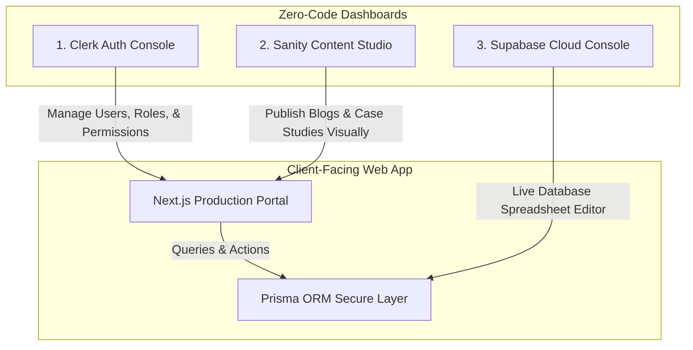

# Sarvalay Luxury Art Platform — Zero-Code Operations Guide

This guide is designed for your client and administrative staff. It explains how to manage **100% of the platform operations** (publishing blogs, editing user roles, creating client projects, updating mural milestones, and clearing invoices) **entirely from visual web dashboards—with absolutely zero coding required.**

---

## 🏗️ The Zero-Code B2B Admin Architecture

Sarvalay operates on a premium serverless design. All site features are powered by three major visual consoles:



---

## 1. Managing Blogs & Case Studies (Sanity Headless CMS)

To let your client post blogs and case studies visually without writing markdown or code, we use **Sanity.io**.

### Step 1: Create a Free Sanity Space
1. Go to [Sanity.io](https://www.sanity.io/) and click **Sign Up** (use Google or GitHub).
2. Once logged in, go to your dashboard and create a new project called `sarvalay-cms`.
3. Select the **Production** dataset (default).
4. Copy your **Project ID** from the Sanity dashboard.

### Step 2: Set Environment Variables
In your production hosting (e.g. Vercel dashboard) or local `.env` file, add these keys:
```env
NEXT_PUBLIC_SANITY_PROJECT_ID="your_sanity_project_id_here"
NEXT_PUBLIC_SANITY_DATASET="production"
```

### Step 3: The Content Schema (Copy-Paste)
When setting up Sanity Studio, define the `post` schema with these fields. (If using Sanity's visual cloud studio, you can define them in the field builder, or copy this JSON definition):
```json
{
  "name": "post",
  "title": "Blog Post",
  "type": "document",
  "fields": [
    { "name": "title", "title": "Title", "type": "string" },
    { "name": "slug", "title": "Slug", "type": "slug", "options": { "source": "title" } },
    { "name": "mainImage", "title": "Main Image", "type": "image" },
    { "name": "publishedAt", "title": "Published At", "type": "datetime" },
    { "name": "excerpt", "title": "Excerpt", "type": "text" },
    { "name": "body", "title": "Body", "type": "text" }
  ]
}
```

### Step 4: Write & Manage Blogs
Your client simply logs into `https://sanity.io/manage` (or runs your deployed Studio URL) to write blogs in a rich-text visual editor.
* Click **Create Document** ➔ **Blog Post**.
* Enter a title, upload a beautiful mural cover image, select a category, and write the post.
* Click **Publish**. The post goes live instantly on `/blog` and `/blog/[slug]` with no rebuilds needed!

---

## 2. Managing Users & Secure Roles (Clerk Authentication)

To ensure secure logins and automatically redirect users to the correct dashboard (Admin, Artist, or Client), we use **Clerk**.

### Step 1: Accessing the Clerk Console
* Sign in to [Clerk.com](https://clerk.com/) and open your `sarvalay-auth` application dashboard.

### Step 2: Syncing New Signups
* When a client or artist logs in for the first time, our platform automatically registers them in the database and assigns them the **CLIENT** role by default.
* If a team member signs up with a `@sarvalay.com` or `gauravmodi8440@gmail.com` email address, our system automatically promotes them to **ADMIN** status.

### Step 3: Elevating Roles (Visual Assignment)
To promote an artist or assign a specific client role:
1. Go to **Clerk Dashboard** ➔ **Users**.
2. Click on the target user to open their profile.
3. Scroll down to the **Metadata** section.
4. In the **Public Metadata** JSON block, enter the role:
   ```json
   {
     "role": "ARTIST"
   }
   ```
   *(Or `"role": "ADMIN"`, `"role": "CLIENT"`)*
5. Click **Save**. The next time they log in, they will be instantly routed to their secure artist/admin console!

---

## 3. Managing Projects, Invoices, and Leads (Supabase Database)

All transactional records (mural dispatches, physical dimension specifications, invoice payment status, and custom mockups) are stored securely in **Supabase (PostgreSQL)** and synced with Next.js through **Prisma ORM**.

### Step 1: Provisioning the Database
1. Go to [Supabase.com](https://supabase.com/) and create a free project named `sarvalay-db`.
2. Grab the connection string under **Database Settings** ➔ **Connection string** (URI).
3. Set your connection string in your production environment variables as `DATABASE_URL`.

### Step 2: Push Database Structure (One-Time Developer Action)
Run this single command in the project folder to construct all relational tables instantly:
```bash
npx prisma db push
```

### Step 3: Zero-Code Database Management (Supabase Table Editor)
Supabase includes a beautiful, built-in cloud database viewer that looks and acts just like **Microsoft Excel** or **Google Sheets**:

```text
[ Table Selector ] ➔ [ Lead / Project / Invoice / User ]
──────────────────────────────────────────────────────────────────────────
ID       │ Title                │ Client ID   │ Status       │ Progress
─────────┼──────────────────────┼─────────────┼──────────────┼──────────
proj_01  │ Taj Lobby Mural      │ client_99   │ EXECUTING    │ 65%
proj_02  │ WeWork glass overlays│ client_88   │ COMPLETED    │ 100%
```

#### How your client can use it:
* **Add a record manually**: Click **Insert Row**, fill out the fields visually, and hit save.
* **Edit progress/details**: Double-click any cell (e.g. changing project status or updating mural progress value) and hit enter.
* **Check leads**: Open the `Lead` table to read mural consultations submitted via the `/consult` and `/contact` forms.
* **Clear payments**: Open the `Invoice` table, find the transaction, and double-click `isPaid` to set it to `true`. This automatically triggers active profit shares to the assigned artist.

---

## 4. Operational Workflows (No-Code Operations in Action)

Here is a step-by-step checklist of how everyday business operations run from the visual dashboard:

### 1. Onboarding a Client Lead
* A prospective client fills out the visual consultation form on `/consult`.
* The lead appears instantly in the **Admin Lead Desk** (`/dashboard/admin/leads`).
* The admin clicks **Consulted** or **Proposal Sent** to update the visual state.

### 2. Launching a New Mural Project
* The admin goes to `/dashboard/admin/projects` and clicks **Create Project**.
* Fill out the client's email, name, company name, and the advance payment amount.
* The system automatically generates a set of **50% - 30% - 20% milestone invoices** in the background!

### 3. Assigning Artists
* The admin visits `/dashboard/admin/artists` to review the verified artist network, toggle their current availability, or adjust their billing tiers.
* Go to the Project row, select an available artist from the dropdown, and click **Assign**.
* The mural brief instantly disappears from admin inventory and appears in that artist's secure workspace (`/dashboard/artist/projects`).

### 4. Uploading Design Mockups (Admin IVDE Engine)
* Once the artist or client shares wall coordinates, the admin visits `/dashboard/admin/mockups`.
* Upload the visual mockup design and attach it to the project.
* The client instantly sees the design in their portal under `/dashboard/client/mockups` and can click **Approve** to authorize execution.

### 5. Posting Daily Painting Progress (Artist Action)
* As the artist paints on-site, they open their phone, go to `/dashboard/artist/projects`, take a photo, type a caption (e.g. "Priming and sketching layout grids completed"), and click **Publish to Client**.
* The progress gallery and milestone bars update live on the client's dashboard (`/dashboard/client/projects`) in real-time.

---

### Summary Checklist for Live Go-Live Deployment

| Action | Target Platform | Link / Command |
| :--- | :--- | :--- |
| **User Signups** | Clerk Cloud Portal | [clerk.com](https://clerk.com/) |
| **Blog Publishing** | Sanity Headless CMS | [sanity.io](https://www.sanity.io/) |
| **SQL Spreadsheet Views** | Supabase Table Editor | [supabase.com](https://supabase.com/) |
| **Build & Deploy** | Vercel Serverless Hosting | `git push origin main` |

*This setup ensures that after the initial setup is complete, the Sarvalay team can manage all commercial operations without editing a single line of code!*
